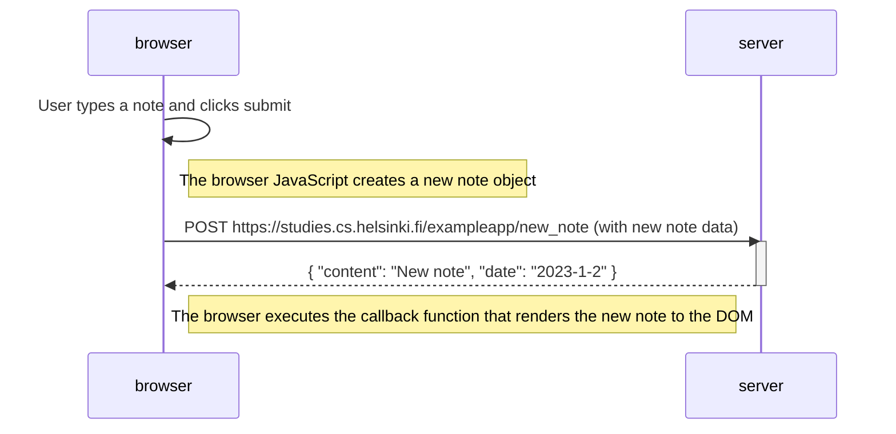

```mermaid
    sequenceDiagram
    participant browser
    participant server

    browser->>browser: User types a note and clicks submit
    
    Note right of browser: The browser JavaScript creates a new note object

    browser->>server: POST https://studies.cs.helsinki.fi/exampleapp/new_note (with new note data)
    activate server
    server-->>browser: { "content": "New note", "date": "2023-1-2" }
    deactivate server

    Note right of browser: The browser executes the callback function that renders the new note to the DOM
```